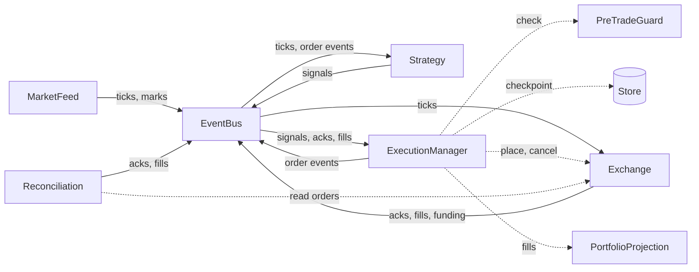
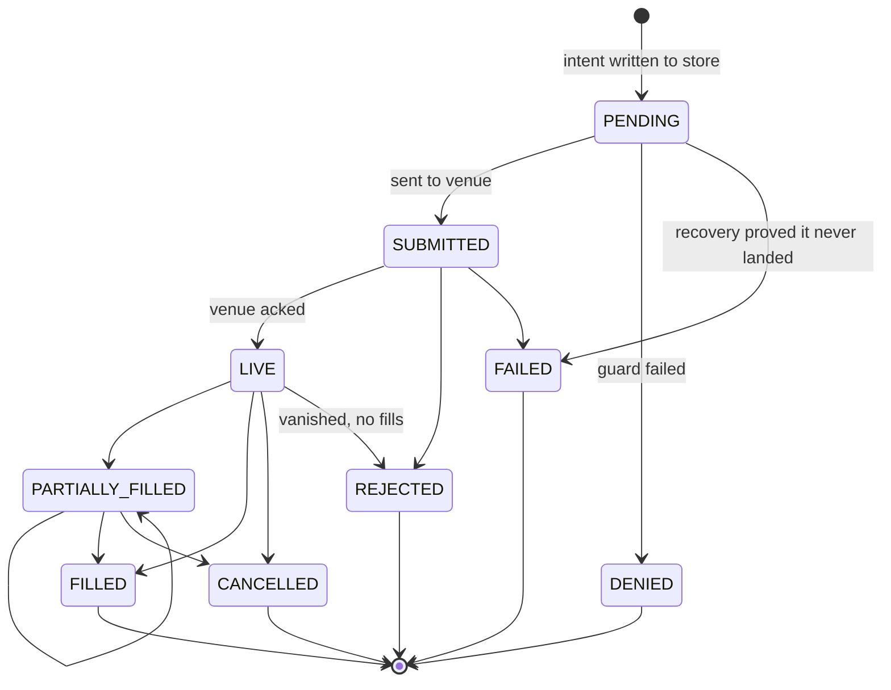
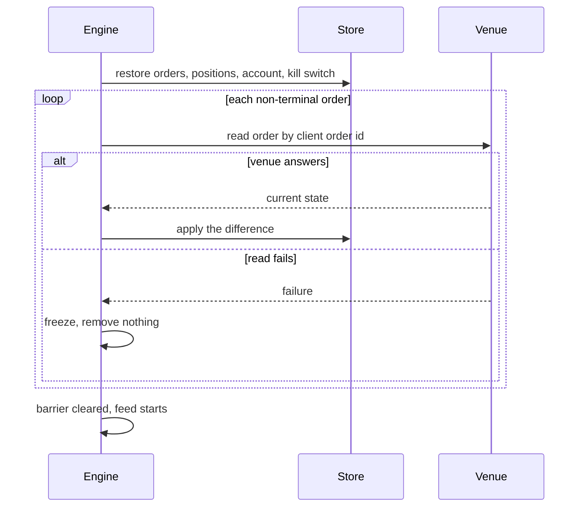
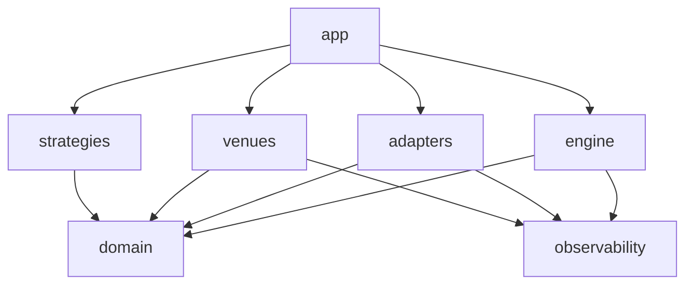

# Tickwright

A readable, event-driven algorithmic trading engine.

[](https://github.com/MarcosACH/tickwright/actions/workflows/ci.yml)
[](LICENSE)

You bring a config and a strategy. Tickwright handles the rest: the market feed, the event flow,
order execution, crash recovery, and reconciliation against the exchange. It runs one venue per
process, on paper or on real money.

The engine is a small, typed Python core. It is built to be read, tested, and extended.

## Quickstart

You need Python 3.13 and [uv](https://github.com/astral-sh/uv). The default setup runs a paper
exchange on a recorded tick file. It needs no external service and no API key.

```bash
uv venv && uv sync      # create the venv and install locked dependencies
uv run pytest           # run the hermetic test suite
cp .env.example .env    # the sample config
uv run tickwright       # run the engine
```

The run replays [`examples/ticks.jsonl`](examples/ticks.jsonl) through the demo
`single_shot_market` strategy into the paper exchange. The order lifecycle shows up on stdout as
structured JSON:

```json
{"event": "engine.barrier_cleared", "run_id": "run-…", "level": "info"}
{"event": "engine.feed_started", "run_id": "run-…", "level": "info"}
{"event": "order.placed", "signal_id": "demo:BTC:1", "level": "info"}
{"event": "order.submitted", "signal_id": "demo:BTC:1", "level": "info"}
{"event": "order.filled", "cloid": "0x…", "level": "info"}
```

The engine keeps running after the file drains. Press Ctrl-C to stop it. It shuts down cleanly,
leaves resting orders alone, and exits `0`.

### Other setups

Every setting is an environment variable with the `TICKWRIGHT_` prefix. Edit `.env`, no code
changes. [`.env.example`](.env.example) lists every variable, its default, and the decision
behind it.

| Setup | Add to `.env` | Needs |
| --- | --- | --- |
| Live Hyperliquid market data, paper exchange | `TICKWRIGHT_FEED=hyperliquid`<br>`TICKWRIGHT_HYPERLIQUID__SYMBOLS=["BTC"]` | Nothing. The data channels are public. |
| Hyperliquid testnet, real order flow | The two lines above, plus<br>`TICKWRIGHT_EXCHANGE=hyperliquid`<br>`TICKWRIGHT_HYPERLIQUID__TESTNET=true`<br>`TICKWRIGHT_HYPERLIQUID__SIGNING_KEY=0x…` | A funded testnet wallet. |
| Kafka bus | `TICKWRIGHT_BUS=kafka` | `docker compose up -d kafka` |
| Postgres store | `TICKWRIGHT_STORE=postgres` | `docker compose up -d postgres` |

Set `TICKWRIGHT_HYPERLIQUID__TESTNET=false` and the same key to trade real money. Read the
[risk note](#risk) first.

## How a tick becomes an order

Solid arrows are events on the `EventBus`. Dashed arrows are direct method calls.



- The `EventBus` is the only coupling between components. Everything publishes and subscribes by
  event type. Reads are never bus messages. Reconciliation reads the venue by a direct call.
- The `PreTradeGuard` runs before every placement. It checks size and price validity, min notional,
  and the kill switch. A failed check denies the order and nothing is sent.
- The `ExecutionManager` writes every order state to the `Store` before it touches the network.
- `Reconciliation` compares local order state with the venue on a schedule and heals the
  difference. A failed venue read is never treated as an empty venue. On a failed read it freezes
  and removes nothing.
- The `PortfolioProjection` keeps one `Position` per symbol and one `Account` per process. Every
  fill updates the position, the account cash line, and the order checkpoint in one transaction.

The runtime is a single `asyncio` process. All time flows through an injected `Clock`, so tests
never sleep.

## Order lifecycle

Every order is a small state machine keyed by its client order id. Each transition is checkpointed.



`SUBMITTED` can also go straight to `PARTIALLY_FILLED`, `FILLED`, or `CANCELLED` when the venue
reports the fill with the ack. A timeout never moves an order. Only reconciliation moves a stuck
`SUBMITTED`.

## Crash recovery

The `PENDING` record is written before the network send. So a crash at any point leaves a record
the engine can check against the venue on restart.



Restarting converges to the same state. No double fill and no orphaned order. The kill switch is
durable too. A halt outlives a crash and is cleared only by an explicit reset.

## Operate it

| Signal | Effect |
| --- | --- |
| `SIGINT` / `SIGTERM` | Graceful stop. Exit code `0`. |
| `SIGUSR1` | Trip the kill switch. New orders are denied. Resting orders stay. |
| `SIGUSR2` | Reset the kill switch. |

A non-zero exit means the engine faulted. That is the restart signal for your supervisor.

## What it does today

- Venues: [Hyperliquid](https://hyperliquid.gitbook.io/hyperliquid-docs) (mainnet and testnet),
  and a deterministic in-process paper exchange with a configurable fill model.
- Feeds: live Hyperliquid WebSocket, and a JSONL replay feed for deterministic runs.
- Buses: `InMemoryBus` and `KafkaBus`.
- Stores: `SQLiteStore` and `PostgresStore`.
- Accounting: positions, realized and unrealized PnL, fees, funding, margin, liquidation price,
  equity, and free margin. Perps only. On live, the numbers are checked against the venue's
  account snapshot and a disagreement is alerted.
- Strategies: two reference strategies that place one market or one limit order. They exist to
  exercise the pipeline.

Each seam has exactly two implementations. One would look hardcoded. Three would be scope creep.

## What it is not

- Not a backtester. The replay feed is a test feed, with no performance analytics.
- Not a risk engine. The accounting surface reports. It never rejects an order on margin and it
  never liquidates.
- Not a plugin system. You extend it by implementing a Protocol. See
  [`docs/extending.md`](docs/extending.md).
- Not fast. It is Python, and it competes on clarity, not latency.
- No GUI, no notifications, no strategy library.

## Package layout

```
src/tickwright/
  domain/         # events, seam Protocols, value types, the order state machine
  engine/         # ExecutionManager, Reconciliation, Cache, PreTradeGuard, runner
  adapters/       # bus/, store/, feed/, paper/, clock/
  venues/         # hyperliquid/
  strategies/     # reference strategies
  observability/  # named events, correlation ids, structured logging
  app/            # composition root: build_engine(config) and the CLI
```

Dependencies point one way. `import-linter` enforces the direction in CI.



## Learn more

- [`CONTEXT.md`](CONTEXT.md): the domain glossary. Start here.
- [`docs/module-maps/v1-core-engine.md`](docs/module-maps/v1-core-engine.md): each module, its
  interface, and why it exists.
- [`docs/extending.md`](docs/extending.md): how to add a strategy, a venue, or a backend.
- [`docs/adr/`](docs/adr/): one record per design decision, with the alternatives rejected.
- [`CONTRIBUTING.md`](CONTRIBUTING.md): setup, checks, test tiers, and how we work.

## Risk

Tickwright is at version `0.x`. It is not certified for real money. Run it against real funds at
your own risk. It is not financial advice.

## License

[Apache-2.0](LICENSE).
