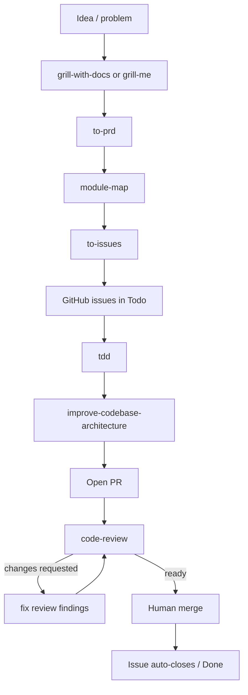

# AI-Assisted Software Development: Core Principles

## 1. LLM Constraints (Smart/Dumb Zones)

**Smart Zone vs Dumb Zone**

- LLMs have limited attention: ~100k tokens is the practical smart zone ceiling
- Every token adds quadratic attention relationships (like adding teams to a league)
- As context grows beyond ~100k, quality degrades significantly
- Solution: Size tasks to stay within smart zone, not to max out available tokens

**Stateless Context (Memento Pattern)**

- LLMs "reset" when you clear context
- Clearing preserves reproducibility (same input = same state)
- Compacting trades reproducibility for continuity
- Prefer clearing context with fresh strategic prompts over compacting

---

## 2. Session Lifecycle

**Four Phases:**

1. **System Prompt** - kept minimal, static
2. **Exploration** - agent explores codebase
3. **Implementation** - code changes
4. **Testing/Feedback** - TDD loops, type checking

Clearing context = return to system prompt only. Tight scope prevents dumb zone.

---

## 3. Reaching Shared Understanding: Grill Me Skill

**Problem:** Specs-to-code fails; AI over-commits too early with insufficient alignment.

**Solution: Grill Me**

- Interview relentlessly about every design decision
- Walk design tree one branch at a time
- AI recommends answers but human confirms
- Creates asset: design concept document (shared mental model)

**Why it works:**

- Frederick P. Brooks: "design concept" = shared understanding between participants
- Prevents silent misalignment before implementation
- Often yields 40-80 clarifying questions
- Output becomes reference for PRD generation

---

## 4. Destination Document: PRD

**Function:** Summarize design concept from grilling session

**Structure:**

- Problem statement
- Solution
- User stories (18-20 for typical feature)
- Implementation decisions
- Out-of-scope definitions
- Testing decisions

**Key insight:** Don't review the PRD deeply; you've already aligned via grilling. PRD just proves the AI can summarize.

---

## 5. Kanban Board: Vertical Slices (Not Horizontal)

**Problem:** AI naturally codes horizontally (all DB, then all API, then all UI). Feedback only arrives at the end.

**Solution: Tracer Bullets (Vertical Slices)**

- Each slice crosses all layers (DB → API → UI/frontend)
- Get feedback on full flow immediately
- Example: "Award points for lesson completion visible on dashboard" (not "Create gamification service")

**Breaking PRD into Issues:**

- Find vertical slice candidates
- Define blocking relationships (kanban board)
- Enables parallelization (independent agents work on independent slices)
- Prevents deep horizontal silos

**Blocking Rules Example:**

- Phase 1: Schema + gamification service (AFK, no blockers)
- Phase 2: Streak tracking (blocked by Phase 1)
- Phase 3: Wire points/streaks into lessons (blocked by 1 & 2)
- Phase 4: Backfill retroactive data (blocked by 1 only)
- Phase 5: Dashboard UI (blocked by all)

---

## 6. End-to-End Skill Flow

**Skill sequence:**

1. `grill-with-docs` / `grill-me` — shared understanding
2. `to-prd` — destination issue
3. `module-map` — architecture anchors
4. `to-issues` — vertical slices
5. `tdd` — implementation
6. `improve-codebase-architecture` — scoped architecture cleanup
7. `code-review` — merge gate

Review fixes are not a new skill: only resolve `code-review` findings.

---

## 7. Implementation: Ralph Loop (AFK Agents)

**Ralph invariant:** one fresh agent, one stage, one skill role. The outer loop clears context between stages.

**Stage order:**

1. Review fixes: pick `ralph:changes-requested`, fix BLOCKING/WARN findings, commit, push, comment resolved IDs, set `ralph:review-addressed`.
2. Code review: pick `ralph:needs-review` or `ralph:review-addressed`, run `code-review`, post to PR, set `ralph:changes-requested` or `ralph:ready`.
3. Wait: if any PR is `ralph:ready`, Ralph stops until the maintainer merges.
4. Architecture + PR: run `improve-codebase-architecture` on a completed `ralph/issue-<N>` branch, apply at most two in-scope fixes, create PR, move card to `In Review`, set `ralph:needs-review`.
5. TDD implementation: pick next `Todo` issue, plan from acceptance criteria, move `needs-triage` → `In Progress`, invoke `tdd`, commit/push branch.
6. Stop: if no stage applies, write `.ralph/STOP`.

**Determinism:**

- `.ralph/state-check.sh` selects the next stage
- `.ralph/doctor.sh` reports drift
- PR labels are the review state source of truth
- `needs-human-validation`, `ready-for-human`, and `needs-info` block Ralph when no eligible AFK work remains
- `Ralph-State: changes-requested|ready` is required in code-review output

**Model selection:**

- `claude-opus-4-7` + 1M context for heavy labels: `critical`, `security`, `crypto`, `auth`, `recovery`, `chain`, `key-material`, `unsafe`
- `claude-sonnet-4-6` for everything else
- Configure in `.ralph/config.sh`

**Rate limits:**

- Ralph stops at `RALPH_MAX_ITERATIONS`
- On rate limit / quota / overload output, Ralph sleeps `RALPH_RATE_LIMIT_COOLDOWN_SECONDS` and retries same state
- Configure in `.ralph/config.sh`

**TDD implementation rules:**

- Write failing test first (red)
- Implement to pass (green)
- Refactor only after green
- One behavior at a time
- Vertical tracer bullet, not horizontal layer

**GitHub lifecycle:**

- Pick issue: remove `needs-triage`; move project Status to `In Progress`
- Ambiguous unattended work: add `needs-human-validation`; leave Status in `Todo`
- Open PR with `Closes #N`; move Status to `In Review`; add `ralph:needs-review`
- Merge auto-closes issue and moves Status to `Done`

**Permission Mode:** `bypassPermissions` by default through `RALPH_PERMISSION_MODE`.

---

## 8. Codebase Architecture: Deep vs Shallow Modules

**Shallow Modules (Bad)**

- Small interfaces, little hidden functionality
- Many exported functions/types
- Hard to test (unclear boundaries)
- Hard for AI to navigate dependencies
- AI tends to produce this by default

**Deep Modules (Good)**

- Small, simple interface
- Lots of hidden functionality inside
- Easy to test as a unit
- Clear dependency graph
- AI can see and test full behavior

**Module Design Strategy:**

- Define module map during planning
- Know the shape; delegate implementation
- Test module in isolation (test boundary spans whole module)
- Retain codebase mental model without reviewing internals

**Consequence of Shallow Codebases:**

- Agents produce worse code
- Feedback loops harder to write
- Quality ceiling is low regardless of AI capabilities

**Improvement:** Run `improve codebase architecture` skill to identify coupling candidates and test gaps.

---

## 9. Code Review & Quality

**Push vs Pull for Coding Standards:**

| Phase | Approach | Reason |
|-------|----------|--------|
| Implementation | Pull (skills, repos to reference) | Agent should explore options |
| Review | Push (standards explicit in prompt) | Reviewer needs direct comparison |

**QA Phase:**

- Run manually to impose taste (prevents slop)
- Cannot be automated without losing design decisions
- Feedback from QA creates new issues for kanban
- QA feeds back into implementation loop

**The Problem:** More code review required now than before. No clear solution yet—accept it as cost of delegation.

---

## 10. Parallelization (Sand Castle Pattern)

**Sequential (Single Agent):** Phases 1 → 2 → 3 → 4

**Parallel (Multiple Agents):**

1. Planner reads kanban, identifies independent phases
2. Spawn N agents, each takes independent slice
3. Reviewer reviews all commits
4. Merger resolves conflicts, re-runs feedback loops

**Key:** Blocking relationships on kanban enable parallelization. Sequential plans cannot.

---

## 11. Workflow Summary (Day Shift / Night Shift)

**Day Shift (Human):**

- Grilling session → design concept
- Write PRD → destination
- Create kanban board → journey with blocks
- Design module map → architectural anchors

**Night Shift (AFK Agents):**

- Pick tasks in parallel
- Implement with TDD
- Run feedback loops
- Report summary

**Back to Day Shift:**

- QA manually, create new issues
- Code review, impose taste
- Merge when satisfied

---

## 12. Best Practices Recap

1. **Size tasks for smart zone**, not max tokens
2. **Grill before you spec** - reach shared understanding
3. **Break vertically** (tracer bullets), not horizontally
4. **Use TDD** - forces good feedback loops
5. **Design deep modules** - AI performs better in clear architecture
6. **Prefer clearing context** to compacting
7. **QA manually** - this is where taste lives
8. **Read old books** (Pragmatic Programmer, Mythical Man-Month, Design of Design) - principles hold in AI era
9. **Automate what you own** - avoid relying on black-box frameworks you can't tune
10. **Delegate implementation; retain architecture** - know the shapes, not the guts

---

## Key Insight

Software engineering fundamentals still work. AI doesn't change core principles—it changes execution speed. The better your architecture, tests, and clarity, the better AI output. Bad codebases stay bad regardless of AI capability.
